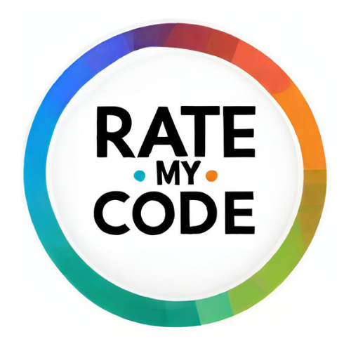

<!-- markdown -->

# Rate My Code

## Description

> The project is currently **under initial development** and is being used as a "*playground*" to learn new technologies and improve my skills, but at this moment I'm working hard to take it to another level and make it work. If you want to contribute, feel free to do so contacting me. I'll be happy to have you on board! [**LinkedIn**](https://www.linkedin.com/in/gabriel-a-batista/) | [**Gmail**](mailto:gabriel.ab.nascimento@gmail.com) | [**GitHub**](https://github.com/gabriel-abn) | Discord: gabrielb_n

1. [Domain Rules](./docs/domain.md)

## Motivation

Every developer had already been in a situation that they needed to get some feedback on their code, either because they were stuck or because they wanted to improve their skills. I'm always asking myself if the code I'm writing is good and readable, if there's a better way to do it, if I'm following the best practices, if what I'm trying to implement is a good solution, etc. And I'm sure I'm not the only one. That's why I decided to create this project, to help developers get feedback on their code and improve their skills.

RateMyCode is a project that was born out of the need to have a place where developers can get some tips and tricks to improve their code and get good feedback from other developers and mentors. It doesn't rely on telling people what is right or wrong, but rather on the community to give feedback on what could be improved and how. I do believe that constructive feedback is the best way to improve as a developer, either receiving or giving it.

> Created by developers, for developers.
